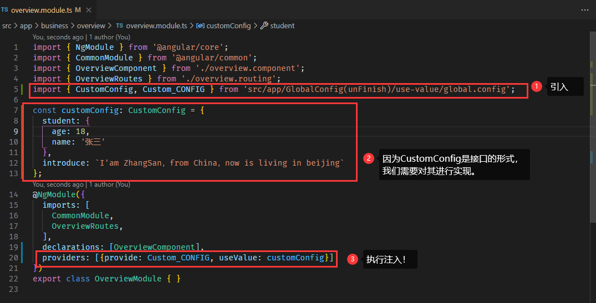
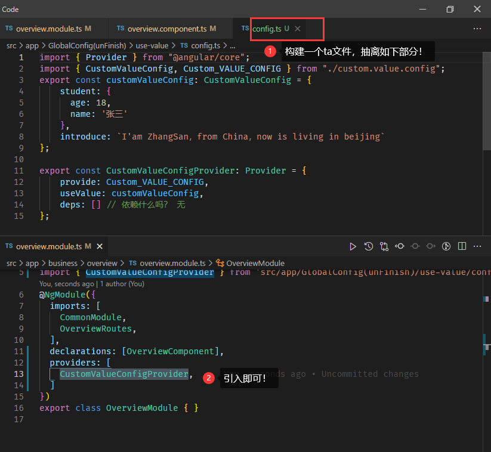

---

   Author: zhuzhu
   Date: 2022-08-22 11:58:51
   Description: 关于依赖注入的全局配置项——值类型
   referLink: https://www.tektutorialshub.com/angular/angular-providers/

---

## How to Use:
### 假设我们需要将这个全局配置项引入到`overview.module.ts`下
1. 方式一：直接在`overview.module.ts`中引入，如下图：
   
      
2. 方式二：
      

### 注入后如何使用？

## References
[（1）Angular Providers: useClass, useValue, useFactory & useExisting](https://www.tektutorialshub.com/angular/angular-providers/)  
[（2）Angular8 Dependency Injection まとめ](https://qiita.com/ringtail003/items/d4329f7e77ce70ccc2d0)  